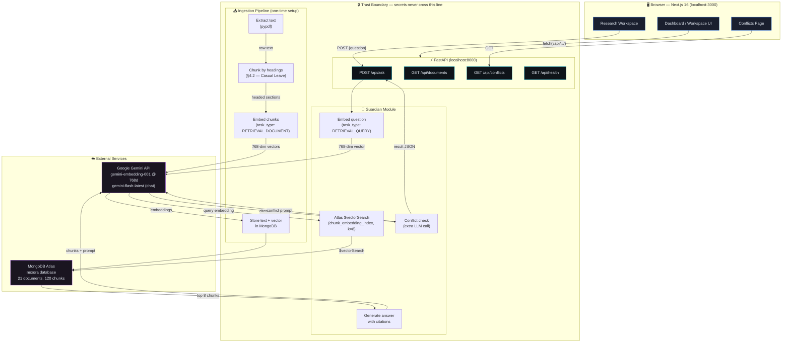

# Deliverable 2 — Vector DB & LLM Pipeline Architecture

## System Architecture Overview

NEXORA Guardian is a Retrieval-Augmented Generation (RAG) system with a unique
conflict-detection layer. The browser never holds secrets — all provider calls
are server-side through FastAPI.



---

## The Two Paths

### Path A — Ingestion (one-time setup, runs from CLI)

| Step | What happens | Code | Output |
|------|-------------|------|--------|
| 1. Extract | `pypdf` pulls text from each of the 21 PDFs | `app/extract.py` | Raw text per document |
| 2. Chunk | Split on document headings (`§4.2 — Casual Leave Entitlement`), not fixed character counts | `app/extract.py` | ~120 coherent sections, each one idea |
| 3. Embed | Each chunk → 768-dimensional vector via `gemini-embedding-001` with `task_type: RETRIEVAL_DOCUMENT` | `app/embeddings.py` | Vectors, L2-normalized (Gemini truncates, not re-normalizes) |
| 4. Store | Chunk text + vector + metadata → MongoDB Atlas `chunks` collection | `scripts/ingest.py` | 120 indexed documents |

**Why heading-based chunking?** Each chunk is one coherent idea, and its heading
becomes the citation string (`Employee Handbook §7.3 — Paid Time Off`) that the
UI displays. Fixed-size chunks break mid-sentence and produce meaningless
citations.

**Why 768 dimensions, not the default 3072?** A quarter of the storage on a
512 MB free-tier cluster, with ample quality at this corpus size. Critically,
Gemini *truncates* rather than re-normalizes for reduced dimensions, so vectors
arrive with L2 norm ~0.59 — `embeddings.py` normalizes before storing.

### Path B — Query (per question, real-time)

| Step | What happens | Code | Output |
|------|-------------|------|--------|
| 5. Embed question | Question → 768-dim vector via `gemini-embedding-001` with `task_type: RETRIEVAL_QUERY` | `app/embeddings.py` | Query vector |
| 6. Vector search | Atlas `$vectorSearch` on index `chunk_embedding_index` returns k=8 nearest chunks | `app/retrieval.py` | 8 most relevant passages |
| 7. Answer | Gemini answers using only retrieved chunks, with section citations | `app/guardian.py` | Grounded answer with sources |
| 8. **Conflict check** | Second LLM call: do these chunks contradict each other on the point asked? | `app/guardian.py` | Conflict report or "sources agree" |

**Step 8 is the differentiator.** It is one extra LLM call with a different
prompt. The innovation is not technically hard — it is that nobody else thought
to check whether the evidence agrees with itself before answering.

---

## Trust Boundary

```
┌─────────────────────────────────────────────────────┐
│  BROWSER (Next.js)                                  │
│  • No API keys                                      │
│  • No database credentials                          │
│  • Only knows http://localhost:8000                  │
│  • NEXT_PUBLIC_API_URL is the sole config            │
├─────────────────────────────────────────────────────┤
│  ↕  HTTP (CORS: localhost:3000 only)                │
├─────────────────────────────────────────────────────┤
│  FASTAPI SERVER (Python)                            │
│  • Holds MONGODB_URI in backend/.env (gitignored)   │
│  • Holds GEMINI_API_KEY in backend/.env (gitignored)│
│  • .env.example committed as template (no values)   │
│  • All Gemini + MongoDB calls happen here            │
│  • Browser never talks to either service directly   │
└─────────────────────────────────────────────────────┘
```

This separation is deliberate and is the entire secret-handling story. The
browser is a pure display layer; extracting the frontend bundle reveals no
credentials.

---

## Technology Specifics

| Component | Technology | Detail |
|-----------|-----------|--------|
| Frontend | Next.js 16.3 (Turbopack) | App Router, TypeScript, Tailwind CSS v4 |
| Backend | FastAPI + Uvicorn | Python 3.x, CORS for localhost:3000 |
| Database | MongoDB Atlas (M0 free tier) | 512 MB, shared cluster |
| Vector Index | Atlas Vector Search | Index: `chunk_embedding_index`, 768 dimensions, cosine similarity |
| Embeddings | `gemini-embedding-001` | 768 dimensions (reduced from default 3072) |
| Chat/Reasoning | `gemini-flash-latest` (alias) | Auto-updating; fallback: `gemini-3-flash-preview` |
| PDF Extraction | pypdf | Heading-aware text extraction |
| Retries | Custom backoff | 429 (rate limit) and 503 (overload) from Gemini free tier |
